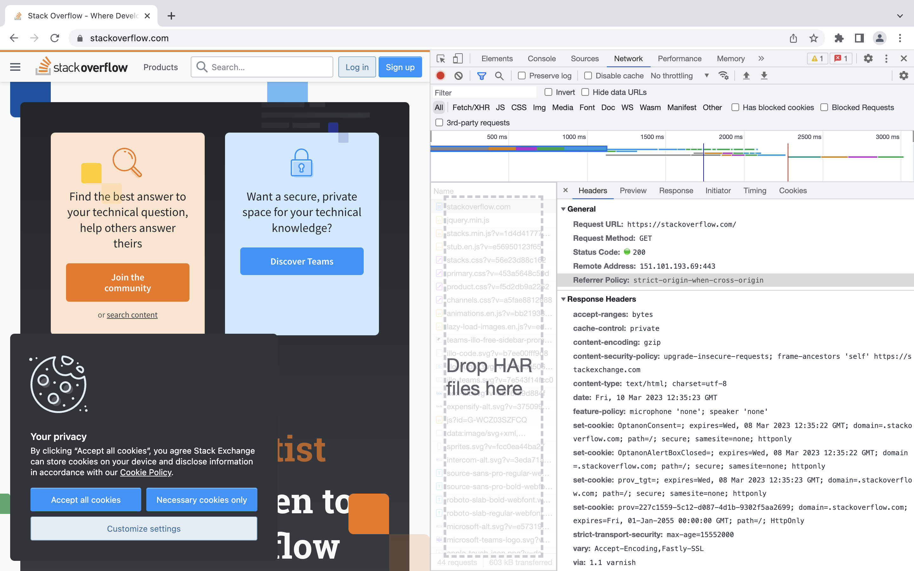

# Домашнее задание к занятию «Компьютерные сети. Лекция 1»


1. Работа c HTTP через telnet

```~$ telnet stackoverflow.com 80
Trying 151.101.65.69...
Connected to stackoverflow.com.
Escape character is '^]'.
GET /questions HTTP/1.0
HOST: stackoverflow.com

HTTP/1.1 403 Forbidden
Connection: close
Content-Length: 1917
Server: Varnish
Retry-After: 0
Content-Type: text/html
Accept-Ranges: bytes
Date: Fri, 10 Mar 2023 12:31:24 GMT
Via: 1.1 varnish
X-Served-By: cache-fty21352-FTY
X-Cache: MISS
X-Cache-Hits: 0
X-Timer: S1678451485.647781,VS0,VE1
X-DNS-Prefetch-Control: off
```

Получаем ответ 403 - доступ запрещен.

2. Повторите задание 1 в браузере, используя консоль разработчика F12



Запрос GET обрабатывался дольше всего, статус 200 - успешно.

3. Какой IP-адрес у вас в интернете?

На маке в терминале через команду
```
curl ifconfig.me
```
89.178.5.225

4. Какому провайдеру принадлежит ваш IP-адрес? Какой автономной системе AS? Воспользуйтесь утилитой whois.

Beeline, AS8402

5. Через какие сети проходит пакет, отправленный с вашего компьютера на адрес 8.8.8.8? Через какие AS? Воспользуйтесь утилитой traceroute.

С виртуальной машины в США

```
$ traceroute -An 8.8.8.8
traceroute to 8.8.8.8 (8.8.8.8), 30 hops max, 60 byte packets
 1  74.201.72.49 [AS1422/AS63018]  0.275 ms  0.270 ms  1.031 ms
 2  31.217.251.4 [AS7578/AS137409]  0.235 ms  0.316 ms  0.310 ms
 3  100.127.240.127 [*]  0.310 ms  0.361 ms  0.354 ms
 4  100.127.240.132 [*]  0.333 ms  0.423 ms  0.416 ms
 5  198.32.118.39 [AS10026]  0.639 ms  0.632 ms  0.619 ms
 6  108.170.248.33 [AS15169]  1.923 ms 108.170.248.65 [AS15169]  1.893 ms 108.170.248.97 [AS15169]  0.859 ms
 7  216.239.62.25 [AS15169]  1.225 ms 216.239.40.167 [AS15169]  0.817 ms 216.239.43.63 [AS15169]  1.212 ms
 8  8.8.8.8 [AS15169/AS263411]  0.781 ms  1.187 ms  0.783 ms
```

6. Повторите задание 5 в утилите mtr. На каком участке наибольшая задержка — delay?

```
                             My traceroute  [v0.92]
nyc-436944.op-net.com (74.201.72.50)                   2023-03-10T04:56:52-0800
Keys:  Help   Display mode   Restart statistics   Order of fields   quit
                                       Packets               Pings
 Host                                Loss%   Snt   Last   Avg  Best  Wrst StDev
 1. _gateway                          0.0%    40    0.3   1.2   0.2  13.6   2.4
 2. ny2.gslnetworks.com               0.0%    40    0.3   0.3   0.3   0.4   0.0
 3. 100.127.240.127                   0.0%    39    0.4   0.4   0.3   0.5   0.0
 4. 100.127.240.132                   0.0%    39    0.4   0.4   0.3   0.5   0.0
 5. core1-0-0-8.lga.net.google.com    0.0%    39    0.6   3.8   0.6  88.7  14.0
 6. 108.170.248.1                     0.0%    39    2.2   2.3   2.1   2.9   0.2
 7. 142.251.60.225                    0.0%    39    1.3   1.3   1.2   1.4   0.0
 8. dns.google                        0.0%    39    1.3   1.2   1.1   1.3   0.0
```

Наибольшие задержки на участке 5 - узел core1-0-0-8.lga.net.google.com

7. Какие DNS-сервера отвечают за доменное имя dns.google? Какие A-записи? Воспользуйтесь утилитой dig.

```
$ dig +short NS dns.google
ns1.zdns.google.
ns3.zdns.google.
ns4.zdns.google.
ns2.zdns.google.

$ dig +short A dns.google
8.8.4.4
8.8.8.8
```

8. Проверьте PTR записи для IP-адресов из задания 7. Какое доменное имя привязано к IP? Воспользуйтесь утилитой dig.

```
$ dig +noall +answer -x 8.8.8.8
8.8.8.8.in-addr.arpa.	6885	IN	PTR	dns.google.

$ dig +noall +answer -x 8.8.4.4
4.4.8.8.in-addr.arpa.	19618	IN	PTR	dns.google.
```


